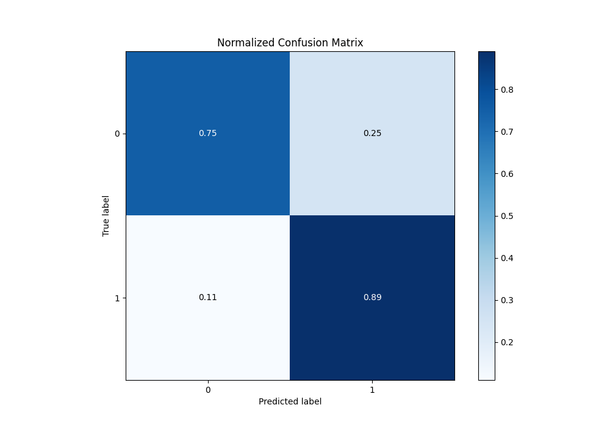

# Summary of 88_RandomForest_Stacked

[<< Go back](../README.md)

## Random Forest
- **n_jobs**: -1
- **criterion**: gini
- **max_features**: 0.8
- **min_samples_split**: 30
- **max_depth**: 7
- **eval_metric_name**: f1
- **explain_level**: 1

## Validation
 - **validation_type**: kfold
 - **k_folds**: 10
 - **shuffle**: True
 - **stratify**: True
 - **random_seed**: 12

## Optimized metric
f1

## Training time

43.0 seconds

## Metric details
|           |    score |    threshold |
|:----------|---------:|-------------:|
| logloss   | 0.404302 | nan          |
| auc       | 0.885145 | nan          |
| f1        | 0.874026 |   0.461636   |
| accuracy  | 0.836637 |   0.508858   |
| precision | 0.965986 |   0.970099   |
| recall    | 1        |   0.00801973 |
| mcc       | 0.644451 |   0.508858   |

## Metric details with threshold from accuracy metric
|           |    score |   threshold |
|:----------|---------:|------------:|
| logloss   | 0.404302 |  nan        |
| auc       | 0.885145 |  nan        |
| f1        | 0.873302 |    0.508858 |
| accuracy  | 0.836637 |    0.508858 |
| precision | 0.857813 |    0.508858 |
| recall    | 0.889362 |    0.508858 |
| mcc       | 0.644451 |    0.508858 |

## Confusion matrix (at threshold=0.508858)
|              |   Predicted as 0 |   Predicted as 1 |
|:-------------|-----------------:|-----------------:|
| Labeled as 0 |             1422 |              485 |
| Labeled as 1 |              364 |             2926 |

## Learning curves

## Permutation-based Importance

## Confusion Matrix

## Normalized Confusion Matrix

## ROC Curve

## Kolmogorov-Smirnov Statistic

## Precision-Recall Curve

## Calibration Curve

## Cumulative Gains Curve

## Lift Curve

[<< Go back](../README.md)
