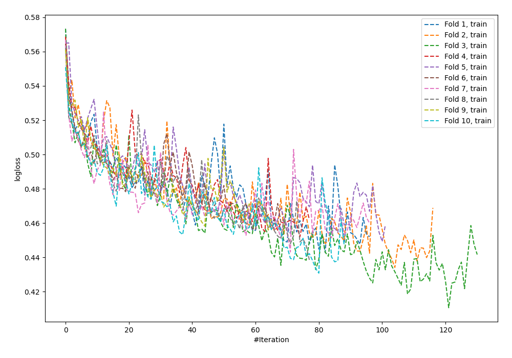
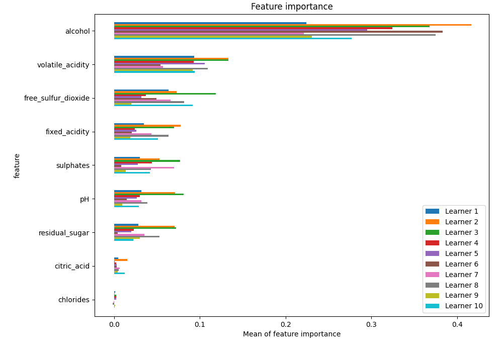
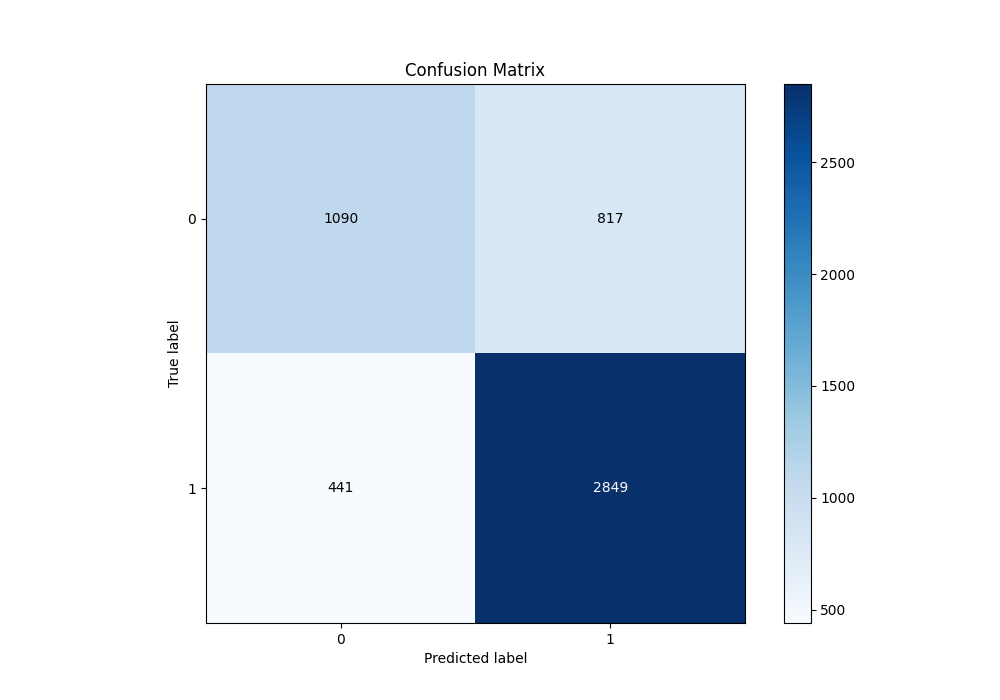
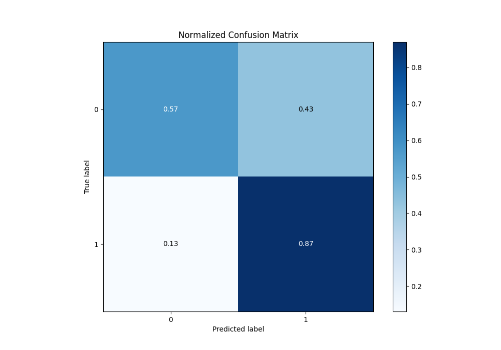
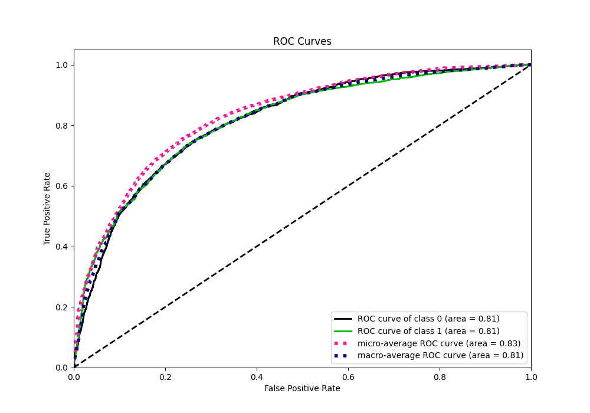
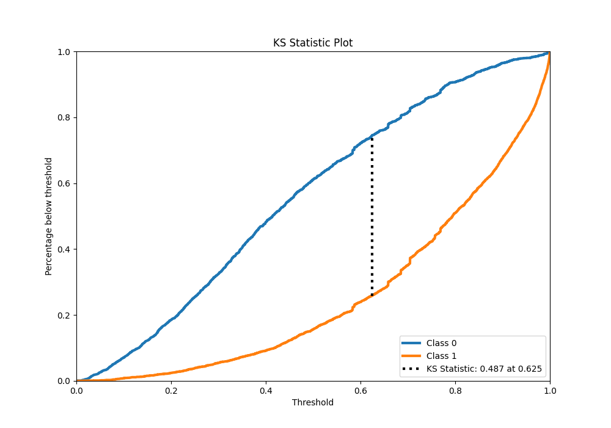
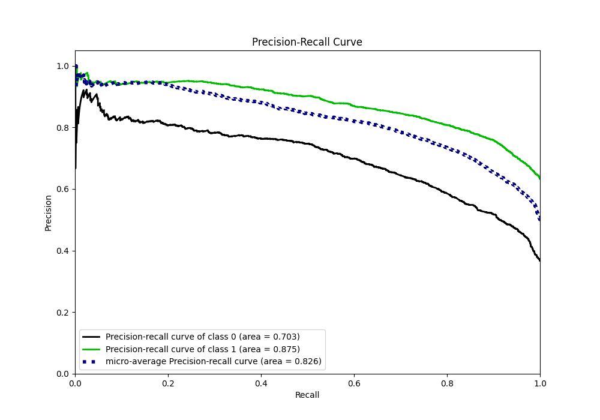
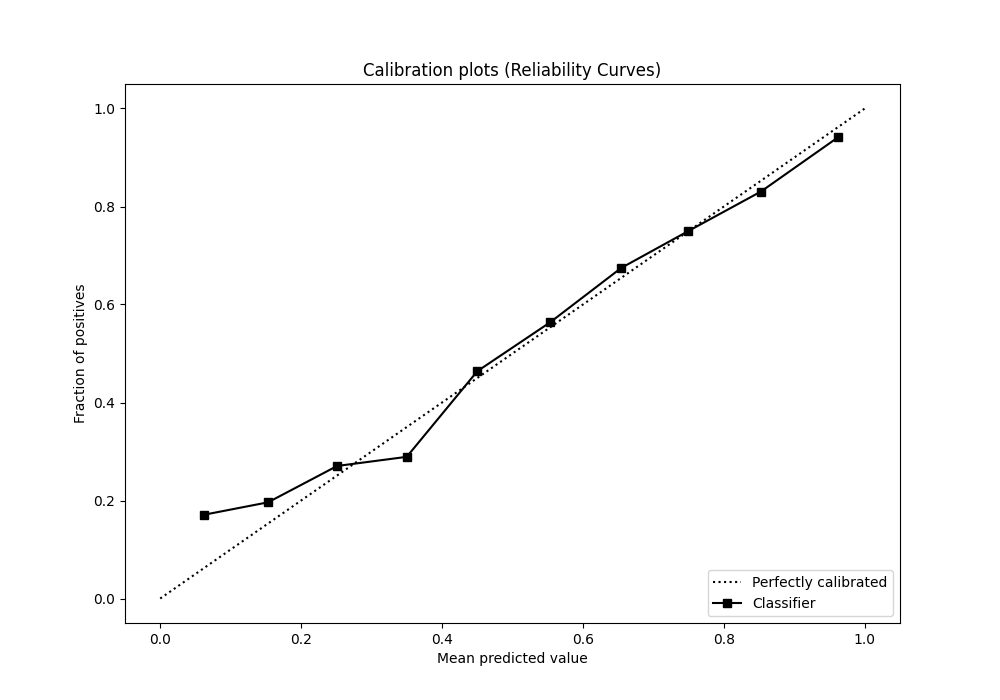
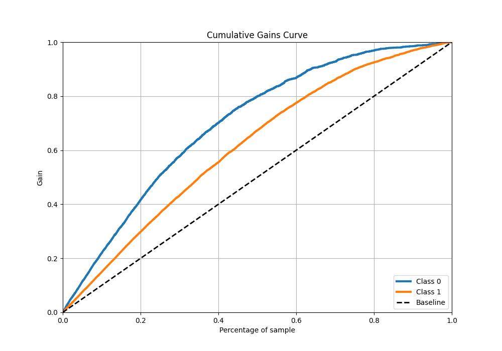
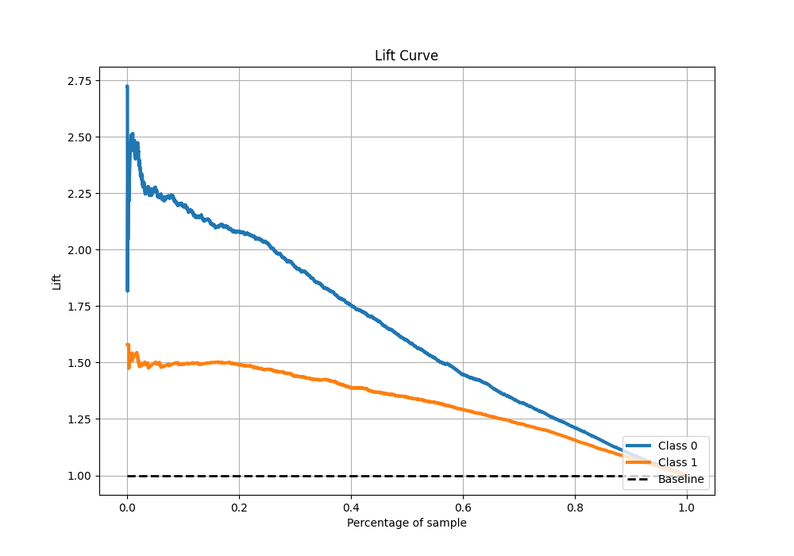

# Summary of 8_Default_NeuralNetwork

[<< Go back](../README.md)

## Neural Network
- **n_jobs**: -1
- **dense_1_size**: 32
- **dense_2_size**: 16
- **learning_rate**: 0.05
- **explain_level**: 1

## Validation
 - **validation_type**: kfold
 - **k_folds**: 10
 - **shuffle**: True
 - **stratify**: True
 - **random_seed**: 12

## Optimized metric
f1

## Training time

8.2 seconds

## Metric details
|           |    score |     threshold |
|:----------|---------:|--------------:|
| logloss   | 0.512523 | nan           |
| auc       | 0.814459 | nan           |
| f1        | 0.822909 |   0.414357    |
| accuracy  | 0.757937 |   0.465485    |
| precision | 0.950617 |   0.941942    |
| recall    | 1        |   0.000728061 |
| mcc       | 0.470739 |   0.641483    |

## Metric details with threshold from accuracy metric
|           |    score |   threshold |
|:----------|---------:|------------:|
| logloss   | 0.512523 |  nan        |
| auc       | 0.814459 |  nan        |
| f1        | 0.819149 |    0.465485 |
| accuracy  | 0.757937 |    0.465485 |
| precision | 0.777141 |    0.465485 |
| recall    | 0.865957 |    0.465485 |
| mcc       | 0.462597 |    0.465485 |

## Confusion matrix (at threshold=0.465485)
|              |   Predicted as 0 |   Predicted as 1 |
|:-------------|-----------------:|-----------------:|
| Labeled as 0 |             1090 |              817 |
| Labeled as 1 |              441 |             2849 |

## Learning curves

## Permutation-based Importance

## Confusion Matrix

## Normalized Confusion Matrix

## ROC Curve

## Kolmogorov-Smirnov Statistic

## Precision-Recall Curve

## Calibration Curve

## Cumulative Gains Curve

## Lift Curve

[<< Go back](../README.md)
