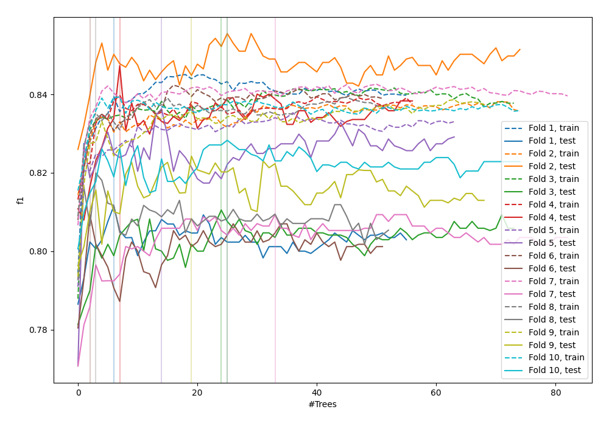
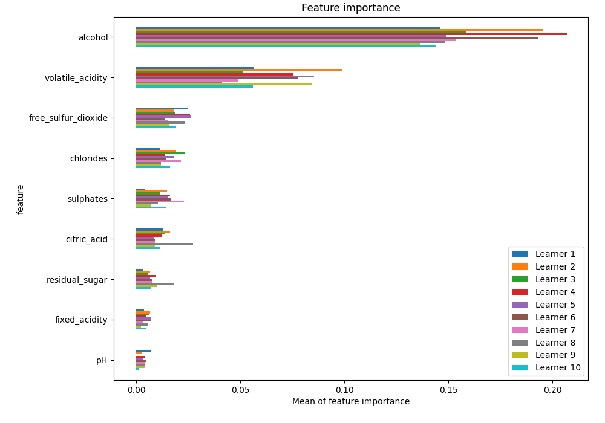
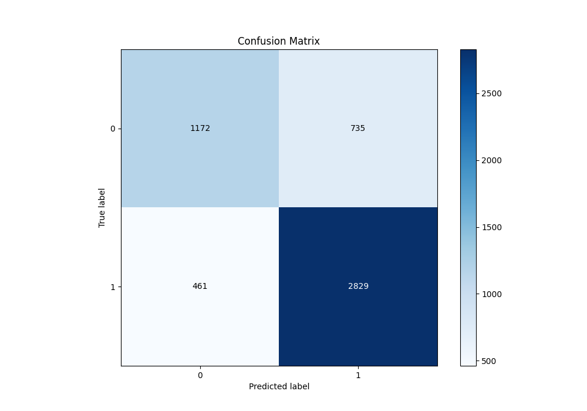
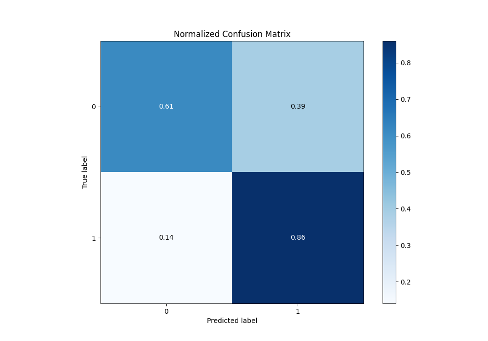
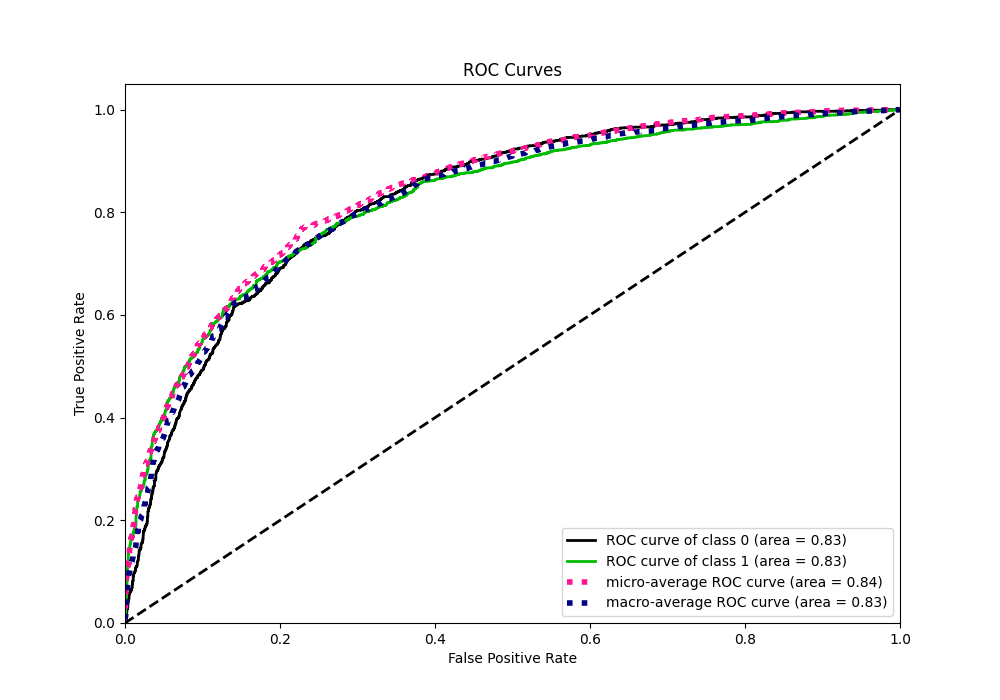
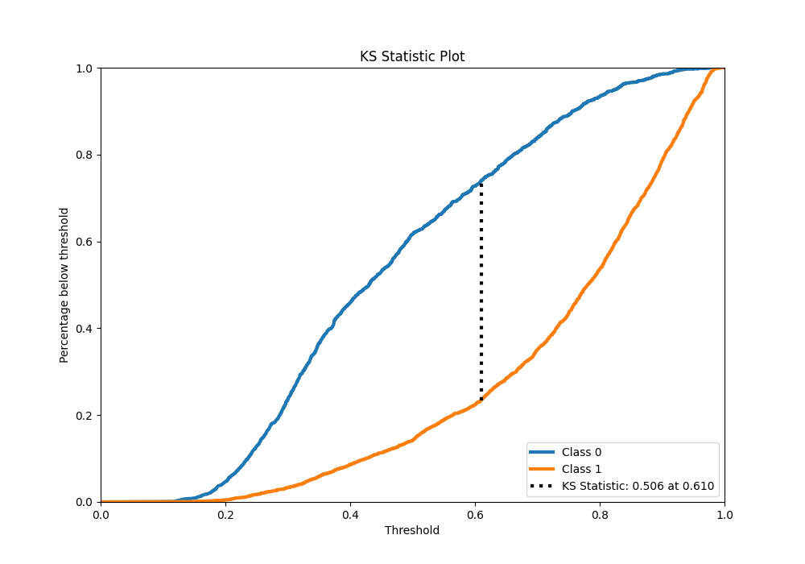
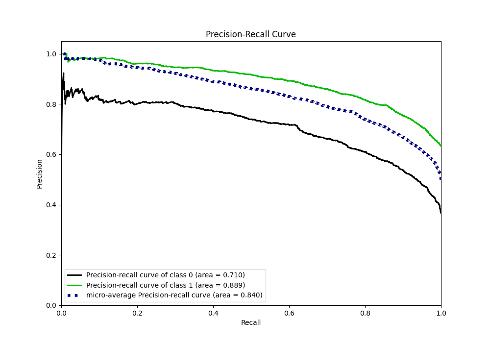
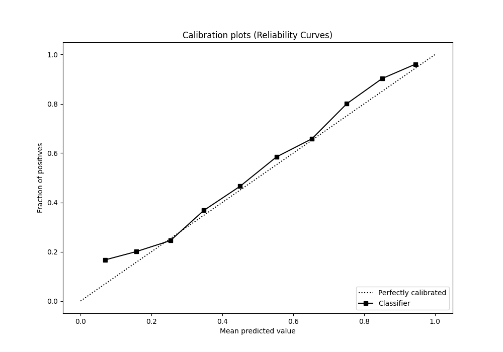
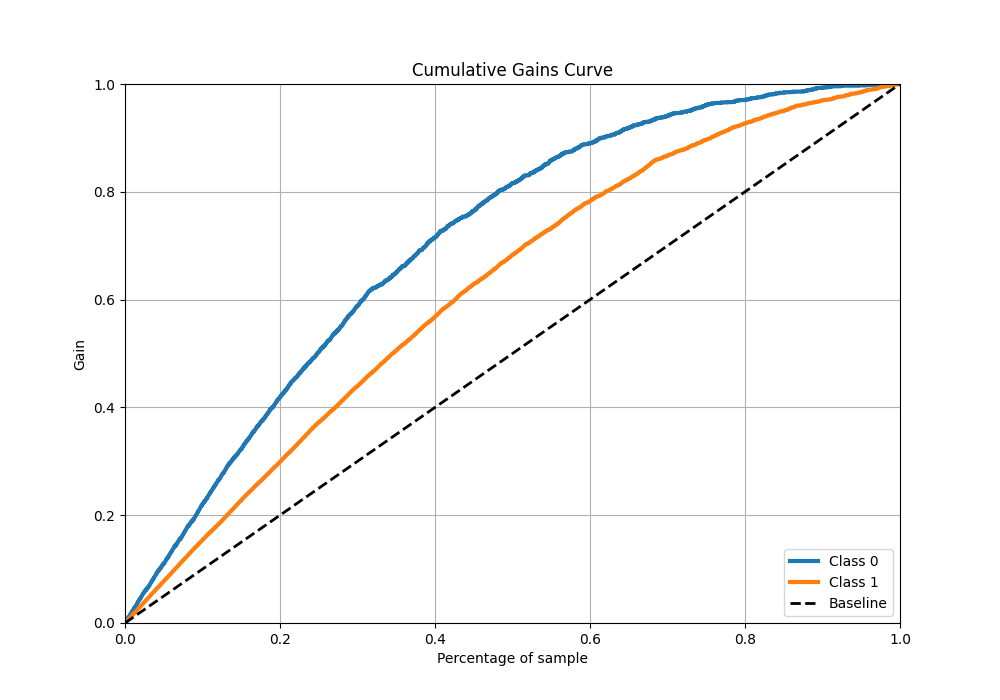
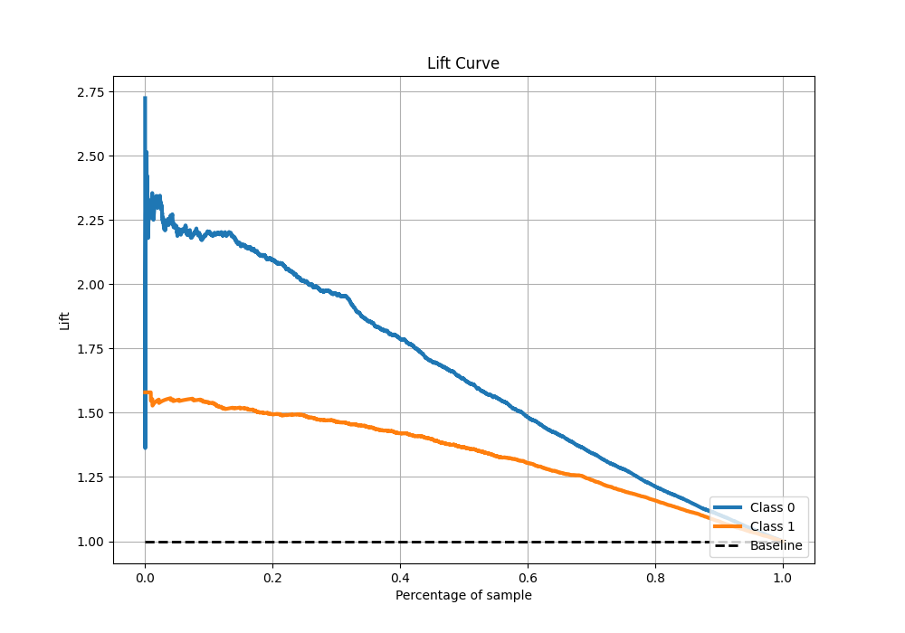

# Summary of 90_RandomForest

[<< Go back](../README.md)

## Random Forest
- **n_jobs**: -1
- **criterion**: entropy
- **max_features**: 0.5
- **min_samples_split**: 50
- **max_depth**: 6
- **eval_metric_name**: f1
- **explain_level**: 1

## Validation
 - **validation_type**: kfold
 - **k_folds**: 10
 - **shuffle**: True
 - **stratify**: True
 - **random_seed**: 12

## Optimized metric
f1

## Training time

14.9 seconds

## Metric details
|           |    score |   threshold |
|:----------|---------:|------------:|
| logloss   | 0.493629 |  nan        |
| auc       | 0.826737 |  nan        |
| f1        | 0.825503 |    0.497754 |
| accuracy  | 0.769867 |    0.497754 |
| precision | 0.984848 |    0.961486 |
| recall    | 1        |    0.077303 |
| mcc       | 0.492813 |    0.603164 |

## Metric details with threshold from accuracy metric
|           |    score |   threshold |
|:----------|---------:|------------:|
| logloss   | 0.493629 |  nan        |
| auc       | 0.826737 |  nan        |
| f1        | 0.825503 |    0.497754 |
| accuracy  | 0.769867 |    0.497754 |
| precision | 0.793771 |    0.497754 |
| recall    | 0.859878 |    0.497754 |
| mcc       | 0.492615 |    0.497754 |

## Confusion matrix (at threshold=0.497754)
|              |   Predicted as 0 |   Predicted as 1 |
|:-------------|-----------------:|-----------------:|
| Labeled as 0 |             1172 |              735 |
| Labeled as 1 |              461 |             2829 |

## Learning curves

## Permutation-based Importance

## Confusion Matrix

## Normalized Confusion Matrix

## ROC Curve

## Kolmogorov-Smirnov Statistic

## Precision-Recall Curve

## Calibration Curve

## Cumulative Gains Curve

## Lift Curve

[<< Go back](../README.md)
