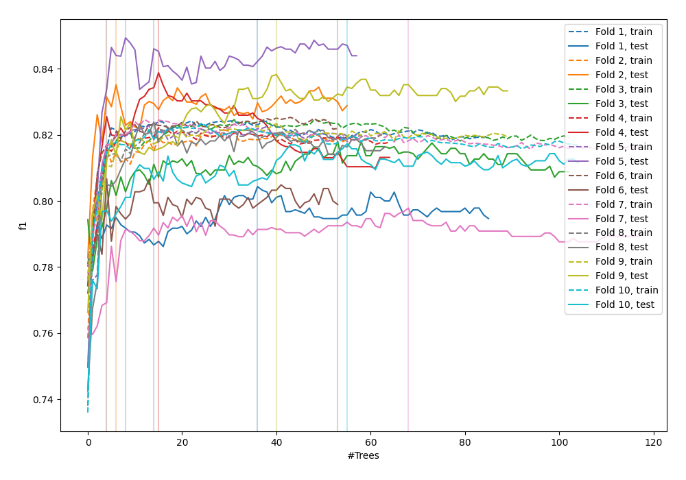
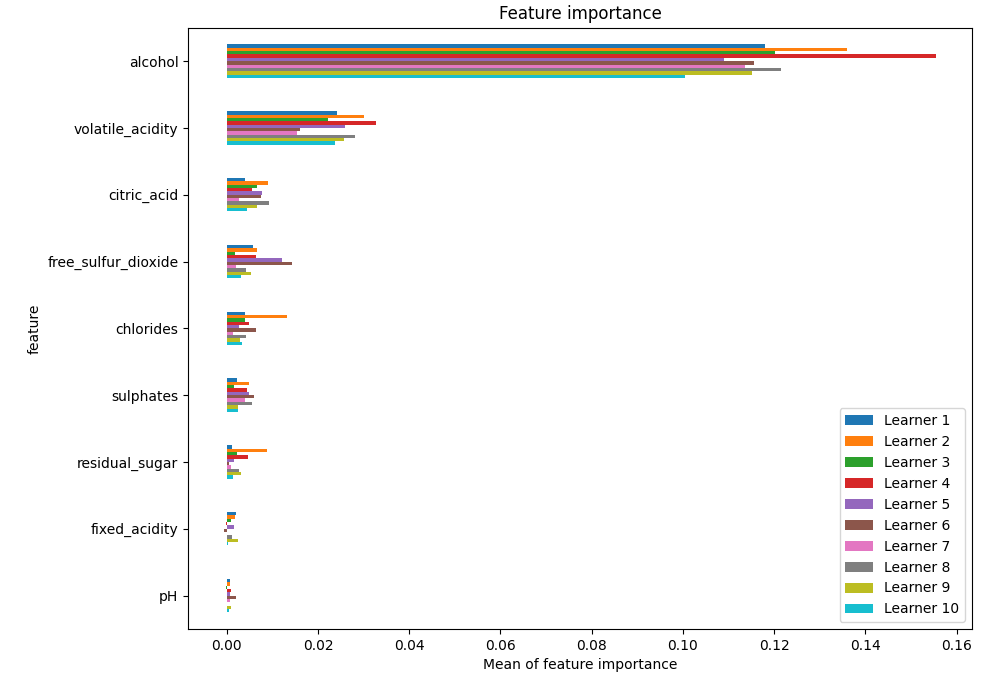
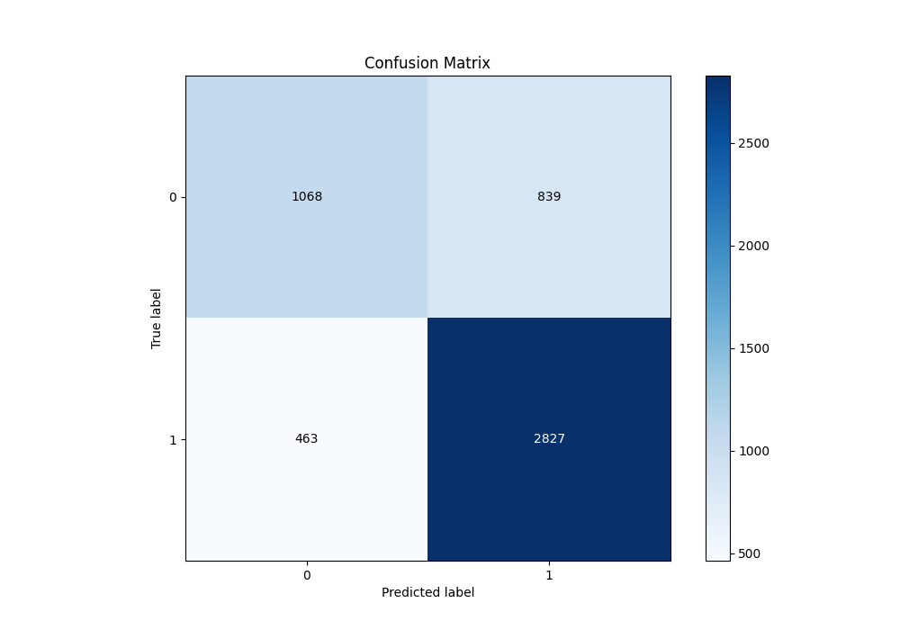
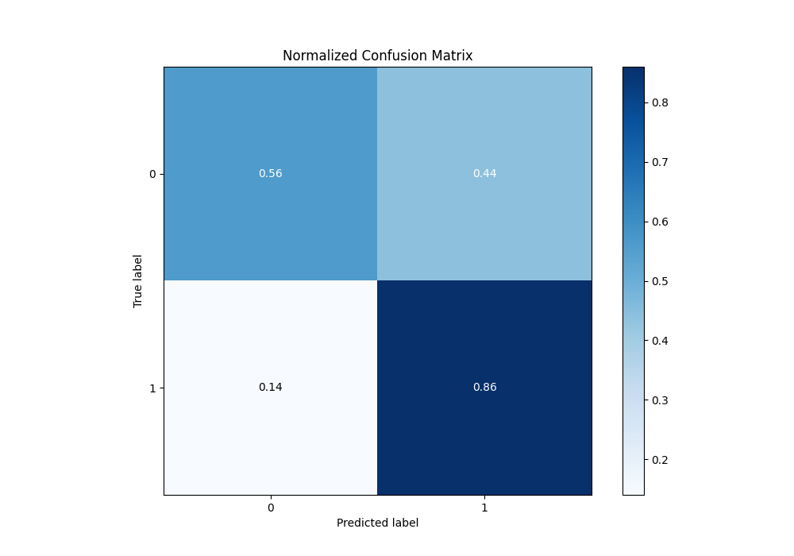
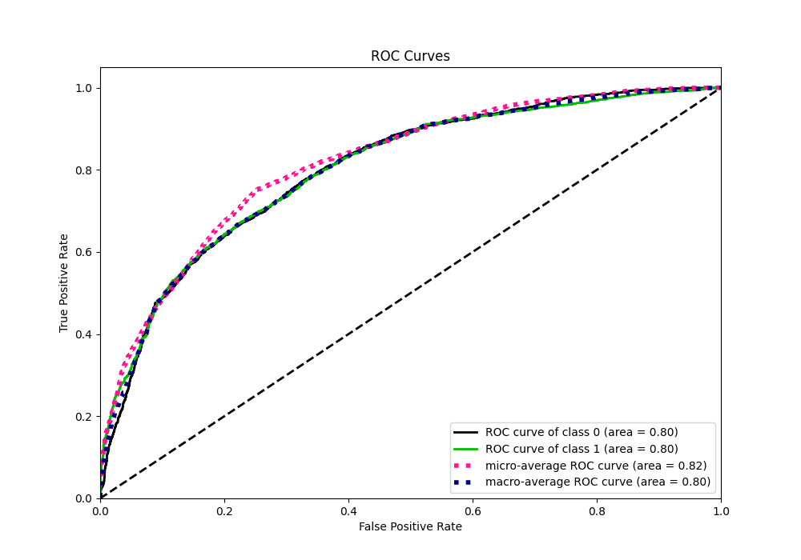
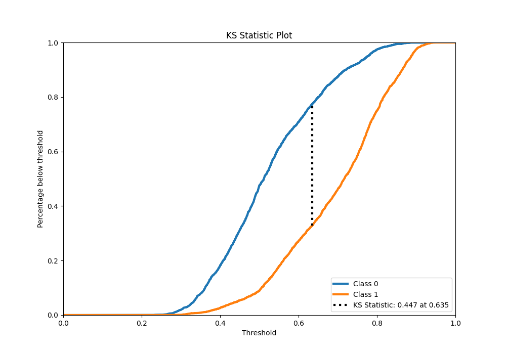
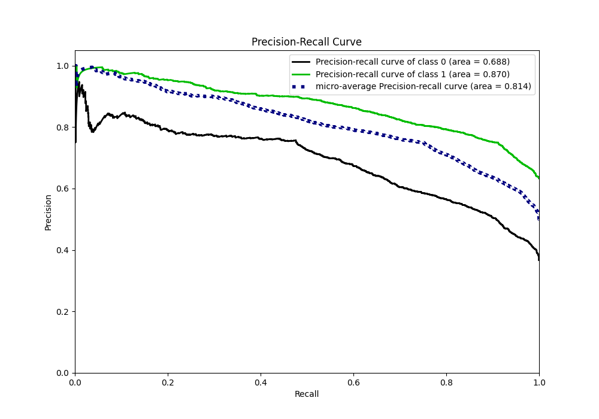
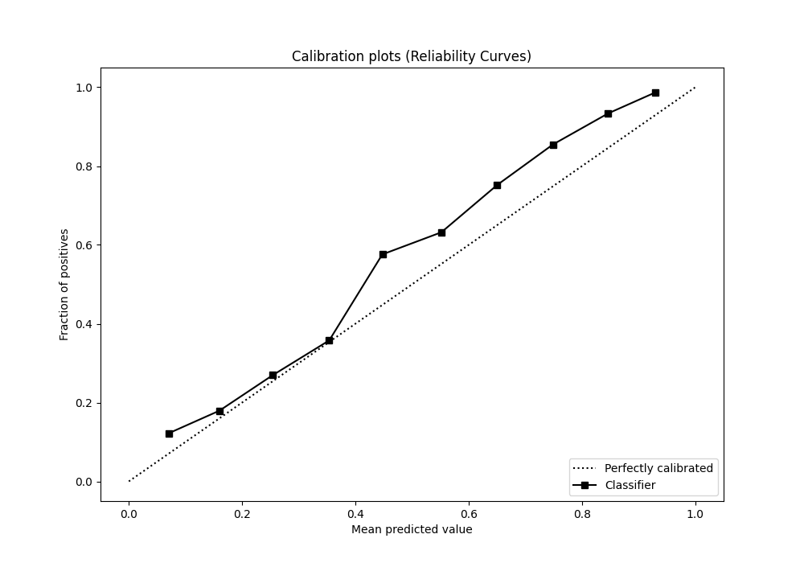
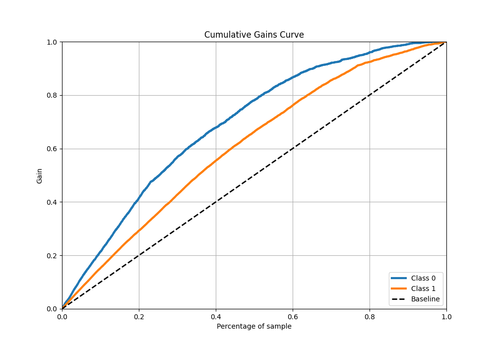
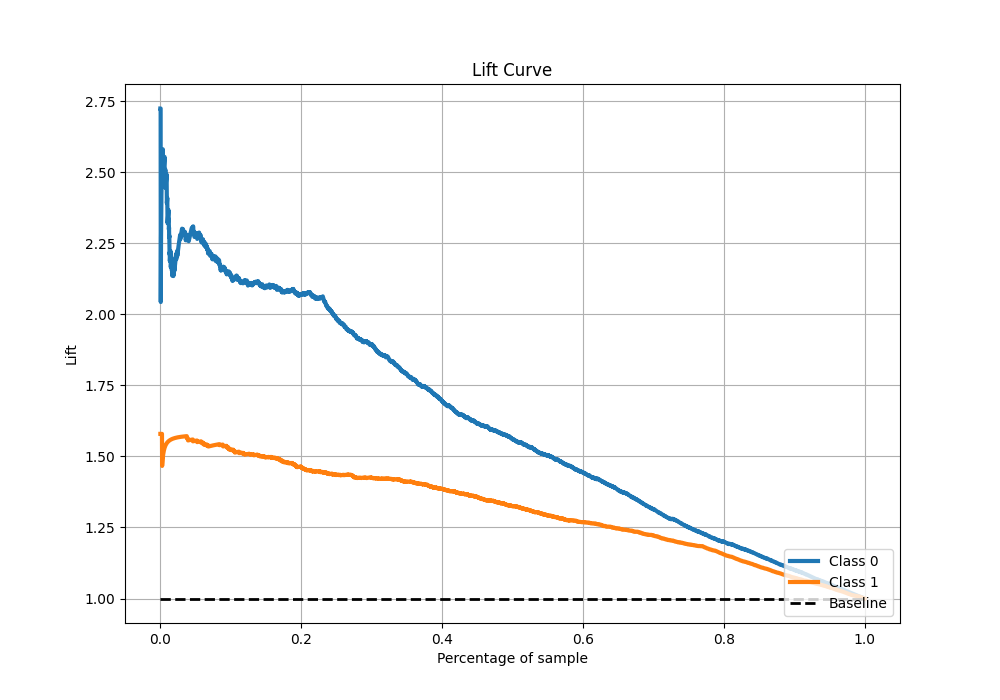

# Summary of 94_ExtraTrees

[<< Go back](../README.md)

## Extra Trees Classifier (Extra Trees)
- **n_jobs**: -1
- **criterion**: gini
- **max_features**: 0.6
- **min_samples_split**: 50
- **max_depth**: 5
- **eval_metric_name**: f1
- **explain_level**: 1

## Validation
 - **validation_type**: kfold
 - **k_folds**: 10
 - **shuffle**: True
 - **stratify**: True
 - **random_seed**: 12

## Optimized metric
f1

## Training time

15.1 seconds

## Metric details
|           |    score |   threshold |
|:----------|---------:|------------:|
| logloss   | 0.539353 |  nan        |
| auc       | 0.801869 |  nan        |
| f1        | 0.821277 |    0.497815 |
| accuracy  | 0.749471 |    0.531732 |
| precision | 0.993197 |    0.8905   |
| recall    | 1        |    0.209292 |
| mcc       | 0.446199 |    0.544041 |

## Metric details with threshold from accuracy metric
|           |    score |   threshold |
|:----------|---------:|------------:|
| logloss   | 0.539353 |  nan        |
| auc       | 0.801869 |  nan        |
| f1        | 0.812823 |    0.531732 |
| accuracy  | 0.749471 |    0.531732 |
| precision | 0.77114  |    0.531732 |
| recall    | 0.859271 |    0.531732 |
| mcc       | 0.44333  |    0.531732 |

## Confusion matrix (at threshold=0.531732)
|              |   Predicted as 0 |   Predicted as 1 |
|:-------------|-----------------:|-----------------:|
| Labeled as 0 |             1068 |              839 |
| Labeled as 1 |              463 |             2827 |

## Learning curves

## Permutation-based Importance

## Confusion Matrix

## Normalized Confusion Matrix

## ROC Curve

## Kolmogorov-Smirnov Statistic

## Precision-Recall Curve

## Calibration Curve

## Cumulative Gains Curve

## Lift Curve

[<< Go back](../README.md)
