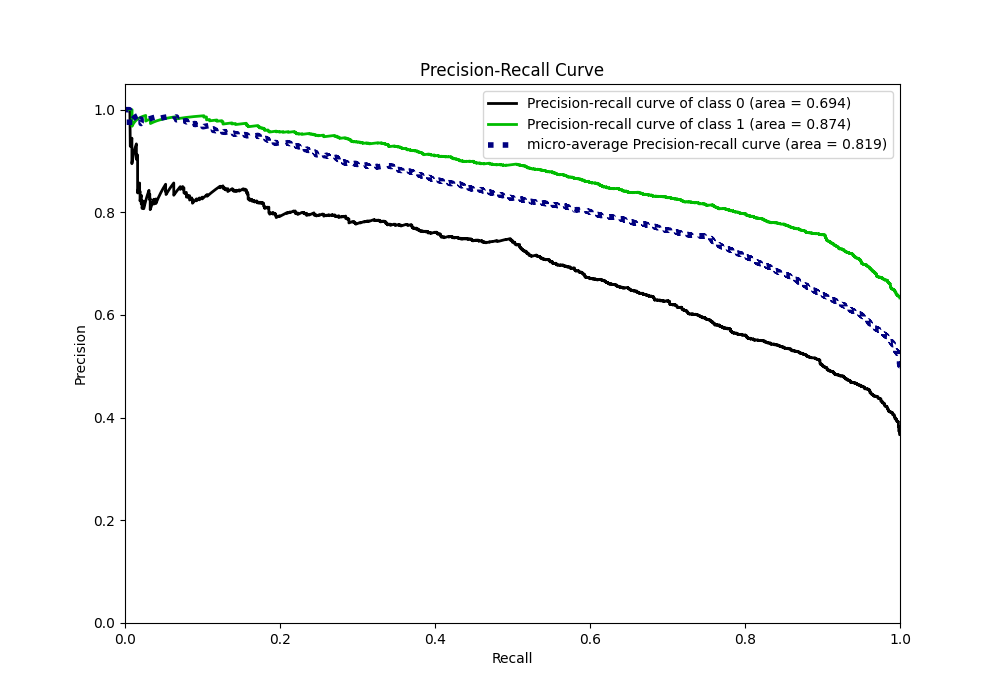

# Summary of 95_ExtraTrees

[<< Go back](../README.md)

## Extra Trees Classifier (Extra Trees)
- **n_jobs**: -1
- **criterion**: gini
- **max_features**: 0.8
- **min_samples_split**: 40
- **max_depth**: 5
- **eval_metric_name**: f1
- **explain_level**: 1

## Validation
 - **validation_type**: kfold
 - **k_folds**: 10
 - **shuffle**: True
 - **stratify**: True
 - **random_seed**: 12

## Optimized metric
f1

## Training time

15.3 seconds

## Metric details
|           |    score |   threshold |
|:----------|---------:|------------:|
| logloss   | 0.530038 |  nan        |
| auc       | 0.805244 |  nan        |
| f1        | 0.822355 |    0.50117  |
| accuracy  | 0.753512 |    0.50117  |
| precision | 0.986667 |    0.890915 |
| recall    | 1        |    0.159643 |
| mcc       | 0.449017 |    0.600789 |

## Metric details with threshold from accuracy metric
|           |    score |   threshold |
|:----------|---------:|------------:|
| logloss   | 0.530038 |   nan       |
| auc       | 0.805244 |   nan       |
| f1        | 0.822355 |     0.50117 |
| accuracy  | 0.753512 |     0.50117 |
| precision | 0.756185 |     0.50117 |
| recall    | 0.901216 |     0.50117 |
| mcc       | 0.447823 |     0.50117 |

## Confusion matrix (at threshold=0.50117)
|              |   Predicted as 0 |   Predicted as 1 |
|:-------------|-----------------:|-----------------:|
| Labeled as 0 |              951 |              956 |
| Labeled as 1 |              325 |             2965 |

## Learning curves

## Permutation-based Importance

## Confusion Matrix

## Normalized Confusion Matrix

## ROC Curve

## Kolmogorov-Smirnov Statistic

## Precision-Recall Curve

## Calibration Curve

## Cumulative Gains Curve

## Lift Curve

[<< Go back](../README.md)
