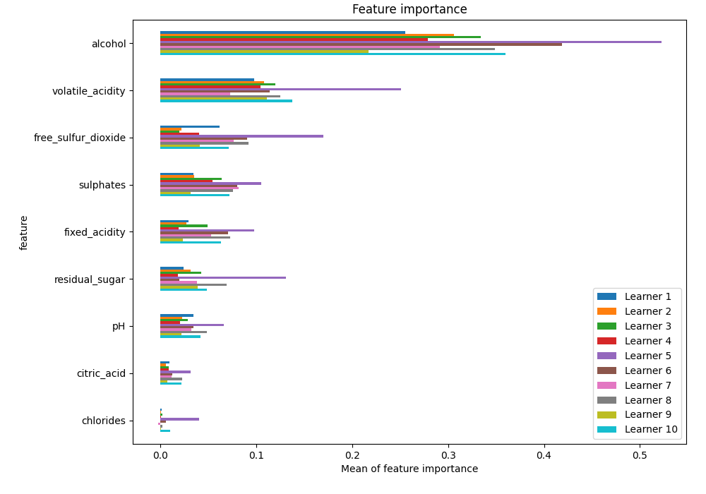
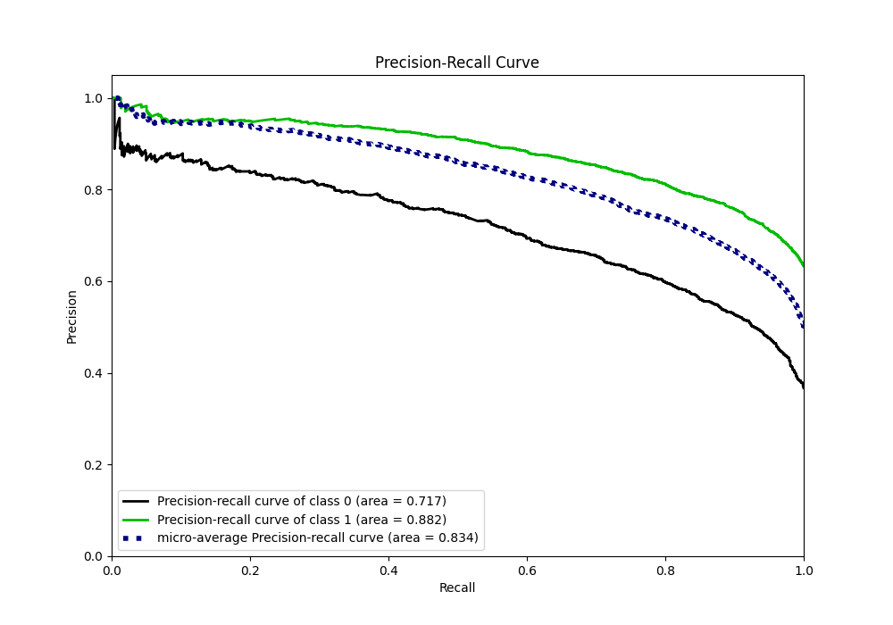

# Summary of 99_NeuralNetwork

[<< Go back](../README.md)

## Neural Network
- **n_jobs**: -1
- **dense_1_size**: 64
- **dense_2_size**: 8
- **learning_rate**: 0.01
- **explain_level**: 1

## Validation
 - **validation_type**: kfold
 - **k_folds**: 10
 - **shuffle**: True
 - **stratify**: True
 - **random_seed**: 12

## Optimized metric
f1

## Training time

21.0 seconds

## Metric details
|           |    score |     threshold |
|:----------|---------:|--------------:|
| logloss   | 0.504592 | nan           |
| auc       | 0.821772 | nan           |
| f1        | 0.822909 |   0.382427    |
| accuracy  | 0.759092 |   0.413026    |
| precision | 0.979592 |   0.996401    |
| recall    | 1        |   3.87171e-06 |
| mcc       | 0.480749 |   0.565346    |

## Metric details with threshold from accuracy metric
|           |    score |   threshold |
|:----------|---------:|------------:|
| logloss   | 0.504592 |  nan        |
| auc       | 0.821772 |  nan        |
| f1        | 0.822613 |    0.413026 |
| accuracy  | 0.759092 |    0.413026 |
| precision | 0.770435 |    0.413026 |
| recall    | 0.882371 |    0.413026 |
| mcc       | 0.462844 |    0.413026 |

## Confusion matrix (at threshold=0.413026)
|              |   Predicted as 0 |   Predicted as 1 |
|:-------------|-----------------:|-----------------:|
| Labeled as 0 |             1042 |              865 |
| Labeled as 1 |              387 |             2903 |

## Learning curves

## Permutation-based Importance

## Confusion Matrix

## Normalized Confusion Matrix

## ROC Curve

## Kolmogorov-Smirnov Statistic

## Precision-Recall Curve

## Calibration Curve

## Cumulative Gains Curve

## Lift Curve

[<< Go back](../README.md)
