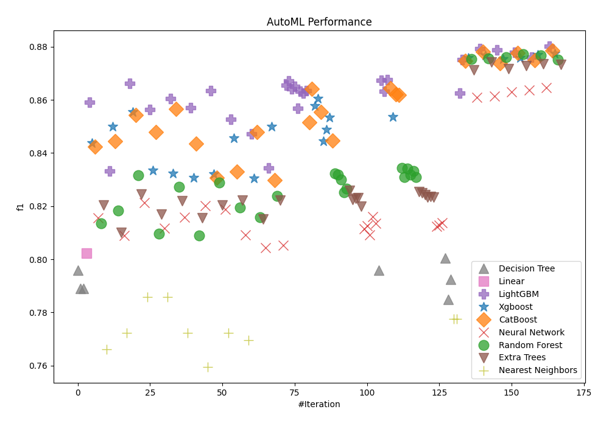
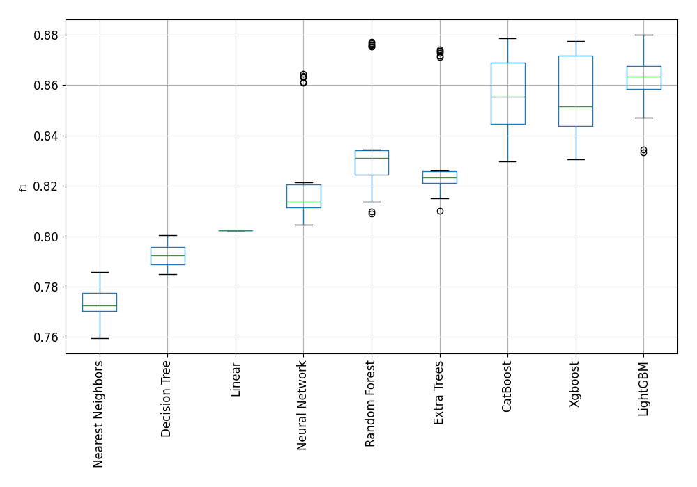

# AutoML Leaderboard

| Best model   | name                                                                               | model_type        | metric_type   |   metric_value |   train_time |
|:-------------|:-----------------------------------------------------------------------------------|:------------------|:--------------|---------------:|-------------:|
|              | [1_DecisionTree](1_DecisionTree/README.md)                                         | Decision Tree     | f1            |       0.795831 |         9.76 |
|              | [2_DecisionTree](2_DecisionTree/README.md)                                         | Decision Tree     | f1            |       0.788969 |        12.73 |
|              | [3_DecisionTree](3_DecisionTree/README.md)                                         | Decision Tree     | f1            |       0.788969 |        12.6  |
|              | [4_Linear](4_Linear/README.md)                                                     | Linear            | f1            |       0.80226  |         5.26 |
|              | [5_Default_LightGBM](5_Default_LightGBM/README.md)                                 | LightGBM          | f1            |       0.859041 |        32.05 |
|              | [6_Default_Xgboost](6_Default_Xgboost/README.md)                                   | Xgboost           | f1            |       0.843704 |        11.15 |
|              | [7_Default_CatBoost](7_Default_CatBoost/README.md)                                 | CatBoost          | f1            |       0.842306 |         7.64 |
|              | [8_Default_NeuralNetwork](8_Default_NeuralNetwork/README.md)                       | Neural Network    | f1            |       0.815685 |         8.89 |
|              | [9_Default_RandomForest](9_Default_RandomForest/README.md)                         | Random Forest     | f1            |       0.813584 |         8.7  |
|              | [10_Default_ExtraTrees](10_Default_ExtraTrees/README.md)                           | Extra Trees       | f1            |       0.820385 |         8.85 |
|              | [11_Default_NearestNeighbors](11_Default_NearestNeighbors/README.md)               | Nearest Neighbors | f1            |       0.766162 |         4.65 |
|              | [21_LightGBM](21_LightGBM/README.md)                                               | LightGBM          | f1            |       0.833333 |        12.1  |
|              | [12_Xgboost](12_Xgboost/README.md)                                                 | Xgboost           | f1            |       0.849889 |        13.5  |
|              | [30_CatBoost](30_CatBoost/README.md)                                               | CatBoost          | f1            |       0.844373 |        10.17 |
|              | [39_RandomForest](39_RandomForest/README.md)                                       | Random Forest     | f1            |       0.818379 |         9.41 |
|              | [48_ExtraTrees](48_ExtraTrees/README.md)                                           | Extra Trees       | f1            |       0.810205 |         9.24 |
|              | [57_NeuralNetwork](57_NeuralNetwork/README.md)                                     | Neural Network    | f1            |       0.808881 |         9.12 |
|              | [66_NearestNeighbors](66_NearestNeighbors/README.md)                               | Nearest Neighbors | f1            |       0.772424 |         5.3  |
|              | [22_LightGBM](22_LightGBM/README.md)                                               | LightGBM          | f1            |       0.866153 |        22.94 |
|              | [13_Xgboost](13_Xgboost/README.md)                                                 | Xgboost           | f1            |       0.8555   |        12.63 |
|              | [31_CatBoost](31_CatBoost/README.md)                                               | CatBoost          | f1            |       0.854317 |        10.99 |
|              | [40_RandomForest](40_RandomForest/README.md)                                       | Random Forest     | f1            |       0.831712 |        10.66 |
|              | [49_ExtraTrees](49_ExtraTrees/README.md)                                           | Extra Trees       | f1            |       0.824601 |        10.38 |
|              | [58_NeuralNetwork](58_NeuralNetwork/README.md)                                     | Neural Network    | f1            |       0.821296 |        17.16 |
|              | [67_NearestNeighbors](67_NearestNeighbors/README.md)                               | Nearest Neighbors | f1            |       0.785735 |         5.97 |
|              | [23_LightGBM](23_LightGBM/README.md)                                               | LightGBM          | f1            |       0.85625  |        33.54 |
|              | [14_Xgboost](14_Xgboost/README.md)                                                 | Xgboost           | f1            |       0.833524 |        11.57 |
|              | [32_CatBoost](32_CatBoost/README.md)                                               | CatBoost          | f1            |       0.847868 |        10.88 |
|              | [41_RandomForest](41_RandomForest/README.md)                                       | Random Forest     | f1            |       0.809717 |        10.82 |
|              | [50_ExtraTrees](50_ExtraTrees/README.md)                                           | Extra Trees       | f1            |       0.816924 |        12.2  |
|              | [59_NeuralNetwork](59_NeuralNetwork/README.md)                                     | Neural Network    | f1            |       0.811706 |        25.19 |
|              | [68_NearestNeighbors](68_NearestNeighbors/README.md)                               | Nearest Neighbors | f1            |       0.785735 |         6.87 |
|              | [24_LightGBM](24_LightGBM/README.md)                                               | LightGBM          | f1            |       0.860393 |        39.05 |
|              | [15_Xgboost](15_Xgboost/README.md)                                                 | Xgboost           | f1            |       0.832319 |        12.38 |
|              | [33_CatBoost](33_CatBoost/README.md)                                               | CatBoost          | f1            |       0.856553 |        11.22 |
|              | [42_RandomForest](42_RandomForest/README.md)                                       | Random Forest     | f1            |       0.827333 |        12.57 |
|              | [51_ExtraTrees](51_ExtraTrees/README.md)                                           | Extra Trees       | f1            |       0.821925 |        11.66 |
|              | [60_NeuralNetwork](60_NeuralNetwork/README.md)                                     | Neural Network    | f1            |       0.815824 |        15.01 |
|              | [69_NearestNeighbors](69_NearestNeighbors/README.md)                               | Nearest Neighbors | f1            |       0.772424 |         7.33 |
|              | [25_LightGBM](25_LightGBM/README.md)                                               | LightGBM          | f1            |       0.857101 |        21.58 |
|              | [16_Xgboost](16_Xgboost/README.md)                                                 | Xgboost           | f1            |       0.830712 |        13.1  |
|              | [34_CatBoost](34_CatBoost/README.md)                                               | CatBoost          | f1            |       0.843543 |        11.3  |
|              | [43_RandomForest](43_RandomForest/README.md)                                       | Random Forest     | f1            |       0.809054 |        11.37 |
|              | [52_ExtraTrees](52_ExtraTrees/README.md)                                           | Extra Trees       | f1            |       0.815595 |        11.7  |
|              | [61_NeuralNetwork](61_NeuralNetwork/README.md)                                     | Neural Network    | f1            |       0.820155 |        17.86 |
|              | [70_NearestNeighbors](70_NearestNeighbors/README.md)                               | Nearest Neighbors | f1            |       0.75959  |         7.68 |
|              | [26_LightGBM](26_LightGBM/README.md)                                               | LightGBM          | f1            |       0.863456 |        46.86 |
|              | [17_Xgboost](17_Xgboost/README.md)                                                 | Xgboost           | f1            |       0.83215  |        12.32 |
|              | [35_CatBoost](35_CatBoost/README.md)                                               | CatBoost          | f1            |       0.83062  |        10.89 |
|              | [44_RandomForest](44_RandomForest/README.md)                                       | Random Forest     | f1            |       0.828909 |        14.49 |
|              | [53_ExtraTrees](53_ExtraTrees/README.md)                                           | Extra Trees       | f1            |       0.82052  |        12.23 |
|              | [62_NeuralNetwork](62_NeuralNetwork/README.md)                                     | Neural Network    | f1            |       0.818849 |        17.55 |
|              | [71_NearestNeighbors](71_NearestNeighbors/README.md)                               | Nearest Neighbors | f1            |       0.772424 |         8.47 |
|              | [27_LightGBM](27_LightGBM/README.md)                                               | LightGBM          | f1            |       0.852765 |        26.51 |
|              | [18_Xgboost](18_Xgboost/README.md)                                                 | Xgboost           | f1            |       0.845632 |        15.72 |
|              | [36_CatBoost](36_CatBoost/README.md)                                               | CatBoost          | f1            |       0.832921 |        12.7  |
|              | [45_RandomForest](45_RandomForest/README.md)                                       | Random Forest     | f1            |       0.81959  |        13.61 |
|              | [54_ExtraTrees](54_ExtraTrees/README.md)                                           | Extra Trees       | f1            |       0.822138 |        12.9  |
|              | [63_NeuralNetwork](63_NeuralNetwork/README.md)                                     | Neural Network    | f1            |       0.809092 |        13.84 |
|              | [72_NearestNeighbors](72_NearestNeighbors/README.md)                               | Nearest Neighbors | f1            |       0.769615 |         8.72 |
|              | [28_LightGBM](28_LightGBM/README.md)                                               | LightGBM          | f1            |       0.847144 |        18.81 |
|              | [19_Xgboost](19_Xgboost/README.md)                                                 | Xgboost           | f1            |       0.830472 |        14.62 |
|              | [37_CatBoost](37_CatBoost/README.md)                                               | CatBoost          | f1            |       0.847842 |        13.79 |
|              | [46_RandomForest](46_RandomForest/README.md)                                       | Random Forest     | f1            |       0.81592  |        13.63 |
|              | [55_ExtraTrees](55_ExtraTrees/README.md)                                           | Extra Trees       | f1            |       0.815183 |        14.65 |
|              | [64_NeuralNetwork](64_NeuralNetwork/README.md)                                     | Neural Network    | f1            |       0.804446 |        17.21 |
|              | [29_LightGBM](29_LightGBM/README.md)                                               | LightGBM          | f1            |       0.834372 |        19.07 |
|              | [20_Xgboost](20_Xgboost/README.md)                                                 | Xgboost           | f1            |       0.849856 |        15.81 |
|              | [38_CatBoost](38_CatBoost/README.md)                                               | CatBoost          | f1            |       0.829809 |        13.16 |
|              | [47_RandomForest](47_RandomForest/README.md)                                       | Random Forest     | f1            |       0.823872 |        13.89 |
|              | [56_ExtraTrees](56_ExtraTrees/README.md)                                           | Extra Trees       | f1            |       0.822154 |        13.35 |
|              | [65_NeuralNetwork](65_NeuralNetwork/README.md)                                     | Neural Network    | f1            |       0.805214 |        14.83 |
|              | [22_LightGBM_KMeansFeatures](22_LightGBM_KMeansFeatures/README.md)                 | LightGBM          | f1            |       0.865442 |        30.21 |
|              | [26_LightGBM_KMeansFeatures](26_LightGBM_KMeansFeatures/README.md)                 | LightGBM          | f1            |       0.867069 |        47.66 |
|              | [24_LightGBM_KMeansFeatures](24_LightGBM_KMeansFeatures/README.md)                 | LightGBM          | f1            |       0.864219 |        44.32 |
|              | [73_LightGBM](73_LightGBM/README.md)                                               | LightGBM          | f1            |       0.865056 |        41.85 |
|              | [74_LightGBM](74_LightGBM/README.md)                                               | LightGBM          | f1            |       0.856763 |        22.08 |
|              | [75_LightGBM](75_LightGBM/README.md)                                               | LightGBM          | f1            |       0.863226 |        35.62 |
|              | [76_LightGBM](76_LightGBM/README.md)                                               | LightGBM          | f1            |       0.862623 |        29.58 |
|              | [77_LightGBM](77_LightGBM/README.md)                                               | LightGBM          | f1            |       0.863414 |        35.01 |
|              | [78_CatBoost](78_CatBoost/README.md)                                               | CatBoost          | f1            |       0.851579 |        13.84 |
|              | [79_CatBoost](79_CatBoost/README.md)                                               | CatBoost          | f1            |       0.864154 |        16.15 |
|              | [80_Xgboost](80_Xgboost/README.md)                                                 | Xgboost           | f1            |       0.857815 |        19.27 |
|              | [81_Xgboost](81_Xgboost/README.md)                                                 | Xgboost           | f1            |       0.860548 |        20.44 |
|              | [82_CatBoost](82_CatBoost/README.md)                                               | CatBoost          | f1            |       0.855452 |        18.32 |
|              | [83_Xgboost](83_Xgboost/README.md)                                                 | Xgboost           | f1            |       0.844516 |        18.35 |
|              | [84_Xgboost](84_Xgboost/README.md)                                                 | Xgboost           | f1            |       0.848746 |        17.48 |
|              | [85_Xgboost](85_Xgboost/README.md)                                                 | Xgboost           | f1            |       0.853353 |        16.86 |
|              | [86_CatBoost](86_CatBoost/README.md)                                               | CatBoost          | f1            |       0.844627 |        14.03 |
|              | [87_RandomForest](87_RandomForest/README.md)                                       | Random Forest     | f1            |       0.832302 |        16.47 |
|              | [88_RandomForest](88_RandomForest/README.md)                                       | Random Forest     | f1            |       0.831838 |        16.94 |
|              | [89_RandomForest](89_RandomForest/README.md)                                       | Random Forest     | f1            |       0.830133 |        17.19 |
|              | [90_RandomForest](90_RandomForest/README.md)                                       | Random Forest     | f1            |       0.825179 |        15.63 |
|              | [91_RandomForest](91_RandomForest/README.md)                                       | Random Forest     | f1            |       0.826592 |        16.26 |
|              | [92_ExtraTrees](92_ExtraTrees/README.md)                                           | Extra Trees       | f1            |       0.825996 |        16.88 |
|              | [93_ExtraTrees](93_ExtraTrees/README.md)                                           | Extra Trees       | f1            |       0.822406 |        15.87 |
|              | [94_ExtraTrees](94_ExtraTrees/README.md)                                           | Extra Trees       | f1            |       0.822835 |        15.89 |
|              | [95_ExtraTrees](95_ExtraTrees/README.md)                                           | Extra Trees       | f1            |       0.823155 |        16.04 |
|              | [96_ExtraTrees](96_ExtraTrees/README.md)                                           | Extra Trees       | f1            |       0.820045 |        15.63 |
|              | [97_NeuralNetwork](97_NeuralNetwork/README.md)                                     | Neural Network    | f1            |       0.811473 |        19.74 |
|              | [98_NeuralNetwork](98_NeuralNetwork/README.md)                                     | Neural Network    | f1            |       0.812603 |        25.54 |
|              | [99_NeuralNetwork](99_NeuralNetwork/README.md)                                     | Neural Network    | f1            |       0.809119 |        21.72 |
|              | [100_NeuralNetwork](100_NeuralNetwork/README.md)                                   | Neural Network    | f1            |       0.816118 |        39.93 |
|              | [101_NeuralNetwork](101_NeuralNetwork/README.md)                                   | Neural Network    | f1            |       0.813554 |        21.85 |
|              | [102_DecisionTree](102_DecisionTree/README.md)                                     | Decision Tree     | f1            |       0.795831 |        17.05 |
|              | [103_LightGBM](103_LightGBM/README.md)                                             | LightGBM          | f1            |       0.867377 |        53.29 |
|              | [104_LightGBM](104_LightGBM/README.md)                                             | LightGBM          | f1            |       0.863333 |        33.96 |
|              | [105_LightGBM](105_LightGBM/README.md)                                             | LightGBM          | f1            |       0.867678 |        34.47 |
|              | [106_CatBoost](106_CatBoost/README.md)                                             | CatBoost          | f1            |       0.864374 |        20.87 |
|              | [107_Xgboost](107_Xgboost/README.md)                                               | Xgboost           | f1            |       0.853687 |        21.96 |
|              | [108_CatBoost](108_CatBoost/README.md)                                             | CatBoost          | f1            |       0.862176 |        18.82 |
|              | [109_CatBoost](109_CatBoost/README.md)                                             | CatBoost          | f1            |       0.861793 |        22.71 |
|              | [110_RandomForest](110_RandomForest/README.md)                                     | Random Forest     | f1            |       0.834367 |        18.22 |
|              | [111_RandomForest](111_RandomForest/README.md)                                     | Random Forest     | f1            |       0.830955 |        19.29 |
|              | [112_RandomForest](112_RandomForest/README.md)                                     | Random Forest     | f1            |       0.834143 |        19.54 |
|              | [113_RandomForest](113_RandomForest/README.md)                                     | Random Forest     | f1            |       0.831858 |        19.14 |
|              | [114_RandomForest](114_RandomForest/README.md)                                     | Random Forest     | f1            |       0.83326  |        19.43 |
|              | [115_RandomForest](115_RandomForest/README.md)                                     | Random Forest     | f1            |       0.831005 |        19.44 |
|              | [116_ExtraTrees](116_ExtraTrees/README.md)                                         | Extra Trees       | f1            |       0.825534 |        18.62 |
|              | [117_ExtraTrees](117_ExtraTrees/README.md)                                         | Extra Trees       | f1            |       0.825021 |        17.78 |
|              | [118_ExtraTrees](118_ExtraTrees/README.md)                                         | Extra Trees       | f1            |       0.824334 |        18.45 |
|              | [119_ExtraTrees](119_ExtraTrees/README.md)                                         | Extra Trees       | f1            |       0.823296 |        17.9  |
|              | [120_ExtraTrees](120_ExtraTrees/README.md)                                         | Extra Trees       | f1            |       0.823643 |        18.26 |
|              | [121_ExtraTrees](121_ExtraTrees/README.md)                                         | Extra Trees       | f1            |       0.823399 |        19.26 |
|              | [122_NeuralNetwork](122_NeuralNetwork/README.md)                                   | Neural Network    | f1            |       0.812313 |        18.81 |
|              | [123_NeuralNetwork](123_NeuralNetwork/README.md)                                   | Neural Network    | f1            |       0.812911 |        17.96 |
|              | [124_NeuralNetwork](124_NeuralNetwork/README.md)                                   | Neural Network    | f1            |       0.813701 |        17.94 |
|              | [125_DecisionTree](125_DecisionTree/README.md)                                     | Decision Tree     | f1            |       0.800404 |        20.13 |
|              | [126_DecisionTree](126_DecisionTree/README.md)                                     | Decision Tree     | f1            |       0.784976 |        18.64 |
|              | [127_DecisionTree](127_DecisionTree/README.md)                                     | Decision Tree     | f1            |       0.792509 |        23.43 |
|              | [128_NearestNeighbors](128_NearestNeighbors/README.md)                             | Nearest Neighbors | f1            |       0.777648 |        14.56 |
|              | [129_NearestNeighbors](129_NearestNeighbors/README.md)                             | Nearest Neighbors | f1            |       0.777648 |        14.69 |
|              | [105_LightGBM_BoostOnErrors](105_LightGBM_BoostOnErrors/README.md)                 | LightGBM          | f1            |       0.862528 |        36.87 |
|              | [105_LightGBM_Stacked](105_LightGBM_Stacked/README.md)                             | LightGBM          | f1            |       0.875186 |        35.73 |
|              | [106_CatBoost_Stacked](106_CatBoost_Stacked/README.md)                             | CatBoost          | f1            |       0.874702 |        30.74 |
|              | [81_Xgboost_Stacked](81_Xgboost_Stacked/README.md)                                 | Xgboost           | f1            |       0.875904 |        24.61 |
|              | [110_RandomForest_Stacked](110_RandomForest_Stacked/README.md)                     | Random Forest     | f1            |       0.87539  |        37.13 |
|              | [92_ExtraTrees_Stacked](92_ExtraTrees_Stacked/README.md)                           | Extra Trees       | f1            |       0.871178 |        29.43 |
|              | [58_NeuralNetwork_Stacked](58_NeuralNetwork_Stacked/README.md)                     | Neural Network    | f1            |       0.860889 |        28.35 |
|              | [103_LightGBM_Stacked](103_LightGBM_Stacked/README.md)                             | LightGBM          | f1            |       0.879318 |        61.2  |
|              | [79_CatBoost_Stacked](79_CatBoost_Stacked/README.md)                               | CatBoost          | f1            |       0.878223 |        33.83 |
|              | [80_Xgboost_Stacked](80_Xgboost_Stacked/README.md)                                 | Xgboost           | f1            |       0.876712 |        27.67 |
|              | [112_RandomForest_Stacked](112_RandomForest_Stacked/README.md)                     | Random Forest     | f1            |       0.875706 |        45.5  |
|              | [116_ExtraTrees_Stacked](116_ExtraTrees_Stacked/README.md)                         | Extra Trees       | f1            |       0.874239 |        31.23 |
|              | [61_NeuralNetwork_Stacked](61_NeuralNetwork_Stacked/README.md)                     | Neural Network    | f1            |       0.861294 |        34.69 |
|              | [26_LightGBM_KMeansFeatures_Stacked](26_LightGBM_KMeansFeatures_Stacked/README.md) | LightGBM          | f1            |       0.878744 |        50.59 |
|              | [108_CatBoost_Stacked](108_CatBoost_Stacked/README.md)                             | CatBoost          | f1            |       0.873676 |        28.24 |
|              | [13_Xgboost_Stacked](13_Xgboost_Stacked/README.md)                                 | Xgboost           | f1            |       0.875425 |        28.92 |
|              | [114_RandomForest_Stacked](114_RandomForest_Stacked/README.md)                     | Random Forest     | f1            |       0.875967 |        45.15 |
|              | [117_ExtraTrees_Stacked](117_ExtraTrees_Stacked/README.md)                         | Extra Trees       | f1            |       0.871726 |        29.04 |
|              | [62_NeuralNetwork_Stacked](62_NeuralNetwork_Stacked/README.md)                     | Neural Network    | f1            |       0.863006 |        28.83 |
|              | [22_LightGBM_Stacked](22_LightGBM_Stacked/README.md)                               | LightGBM          | f1            |       0.877925 |        34.33 |
|              | [109_CatBoost_Stacked](109_CatBoost_Stacked/README.md)                             | CatBoost          | f1            |       0.877569 |        36.58 |
|              | [107_Xgboost_Stacked](107_Xgboost_Stacked/README.md)                               | Xgboost           | f1            |       0.875882 |        25.2  |
|              | [87_RandomForest_Stacked](87_RandomForest_Stacked/README.md)                       | Random Forest     | f1            |       0.877109 |        38.08 |
|              | [49_ExtraTrees_Stacked](49_ExtraTrees_Stacked/README.md)                           | Extra Trees       | f1            |       0.872808 |        29.48 |
|              | [100_NeuralNetwork_Stacked](100_NeuralNetwork_Stacked/README.md)                   | Neural Network    | f1            |       0.863772 |        36.26 |
|              | [22_LightGBM_KMeansFeatures_Stacked](22_LightGBM_KMeansFeatures_Stacked/README.md) | LightGBM          | f1            |       0.876001 |        35.81 |
|              | [33_CatBoost_Stacked](33_CatBoost_Stacked/README.md)                               | CatBoost          | f1            |       0.875    |        28.48 |
|              | [85_Xgboost_Stacked](85_Xgboost_Stacked/README.md)                                 | Xgboost           | f1            |       0.876898 |        27.64 |
|              | [113_RandomForest_Stacked](113_RandomForest_Stacked/README.md)                     | Random Forest     | f1            |       0.876635 |        44.06 |
|              | [118_ExtraTrees_Stacked](118_ExtraTrees_Stacked/README.md)                         | Extra Trees       | f1            |       0.873591 |        28.14 |
|              | [60_NeuralNetwork_Stacked](60_NeuralNetwork_Stacked/README.md)                     | Neural Network    | f1            |       0.864558 |        32.18 |
| **the best** | [73_LightGBM_Stacked](73_LightGBM_Stacked/README.md)                               | LightGBM          | f1            |       0.880081 |        41.53 |
|              | [82_CatBoost_Stacked](82_CatBoost_Stacked/README.md)                               | CatBoost          | f1            |       0.878541 |        34.5  |
|              | [12_Xgboost_Stacked](12_Xgboost_Stacked/README.md)                                 | Xgboost           | f1            |       0.877533 |        28.3  |
|              | [88_RandomForest_Stacked](88_RandomForest_Stacked/README.md)                       | Random Forest     | f1            |       0.875149 |        43.85 |
|              | [120_ExtraTrees_Stacked](120_ExtraTrees_Stacked/README.md)                         | Extra Trees       | f1            |       0.873369 |        29.11 |

### AutoML Performance

### AutoML Performance Boxplot
