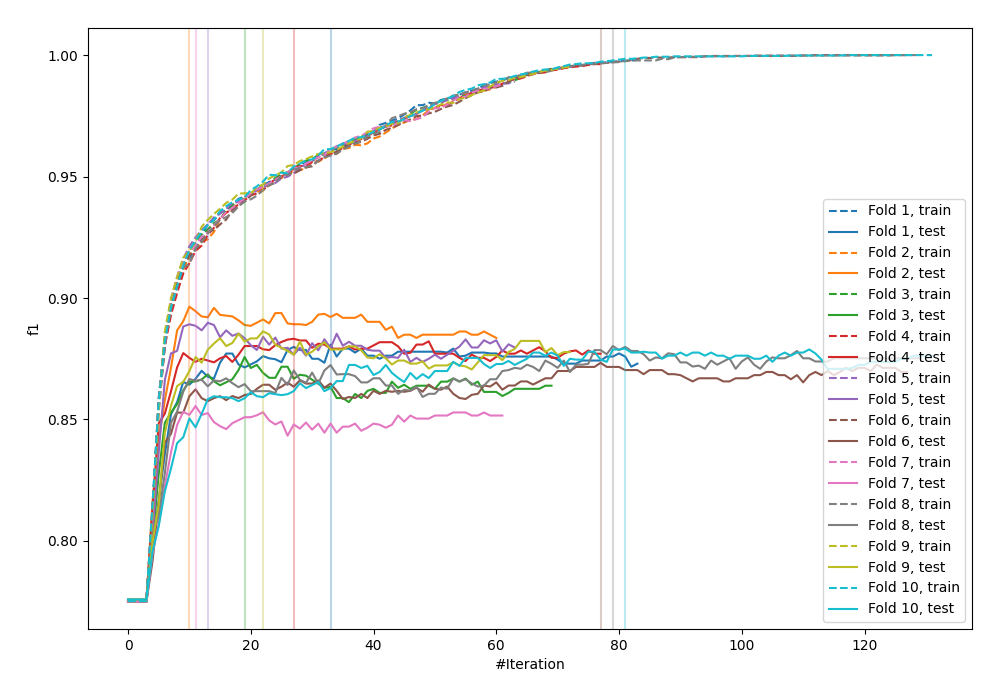
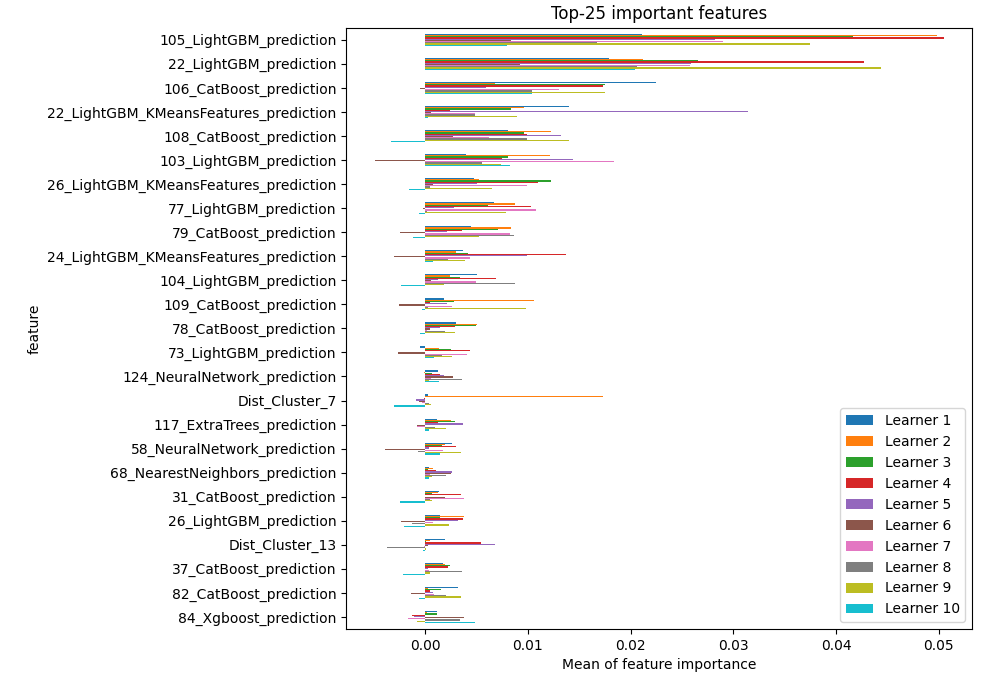
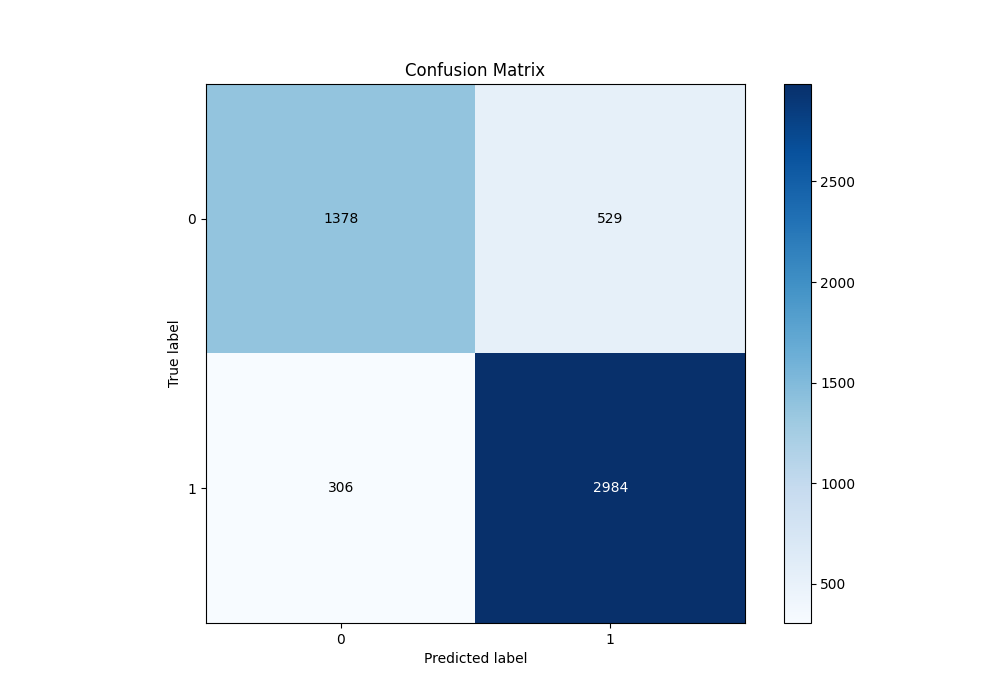
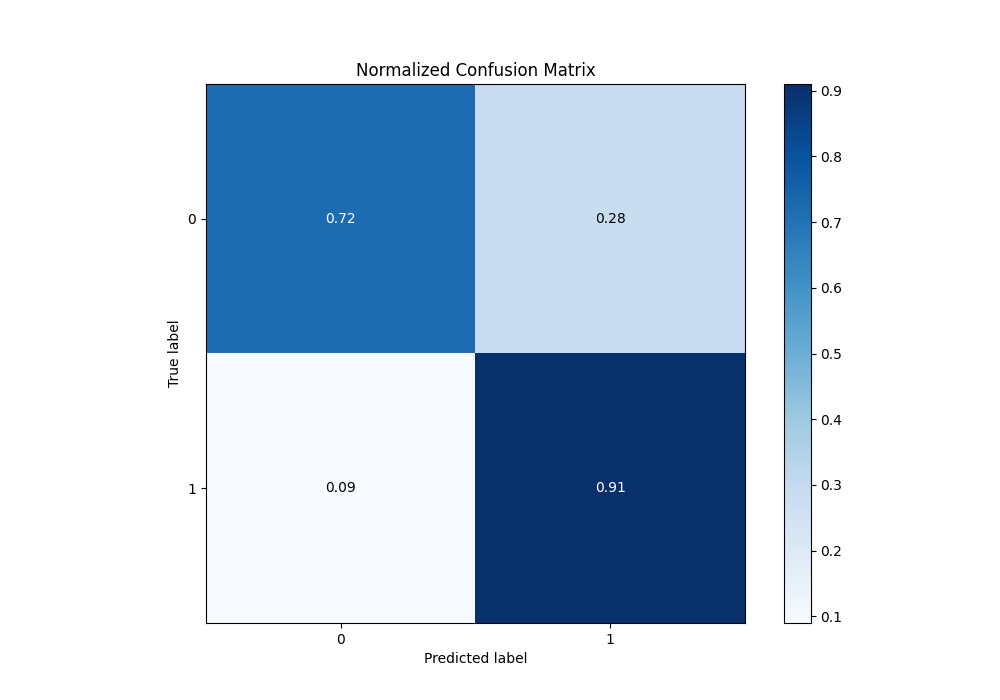
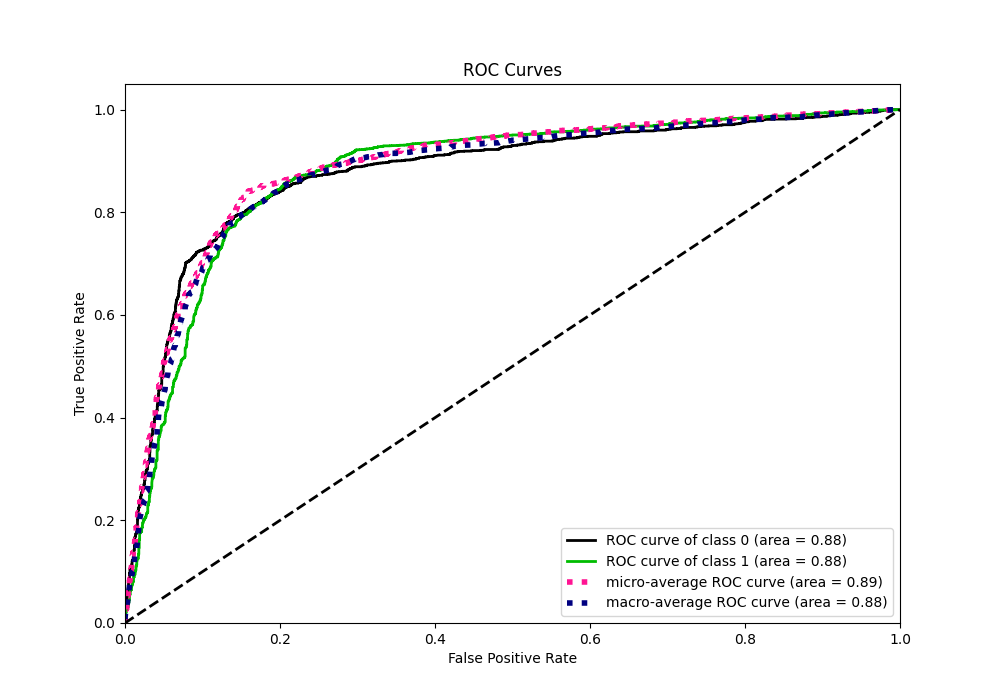
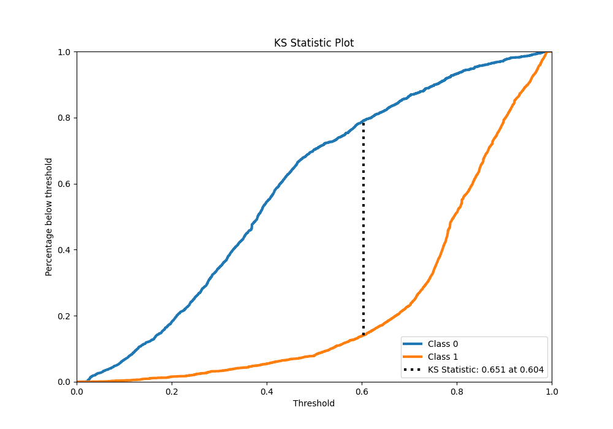
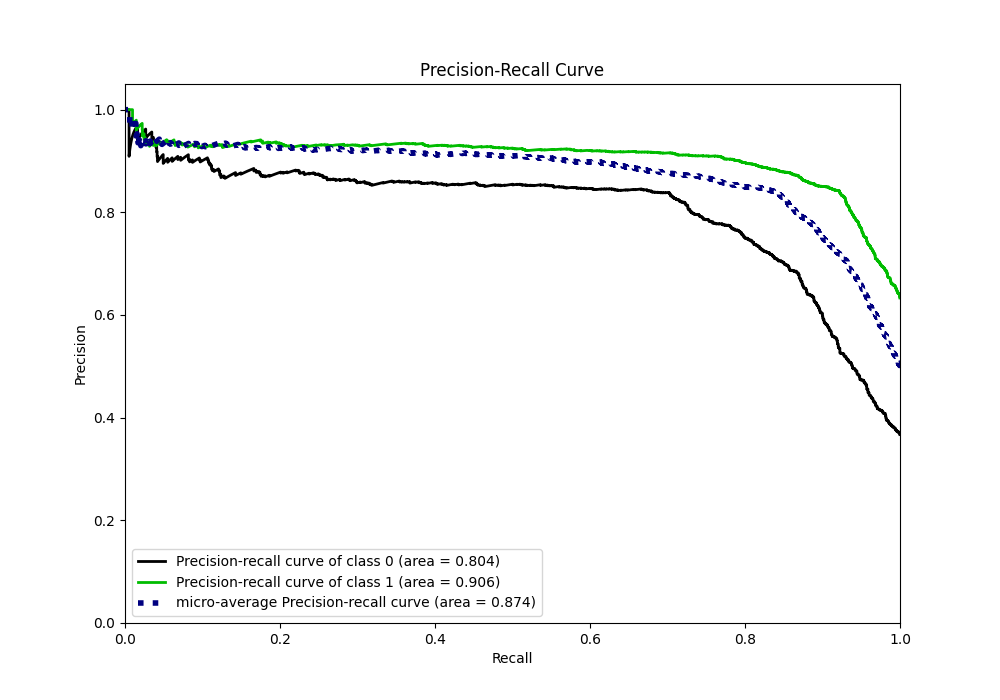
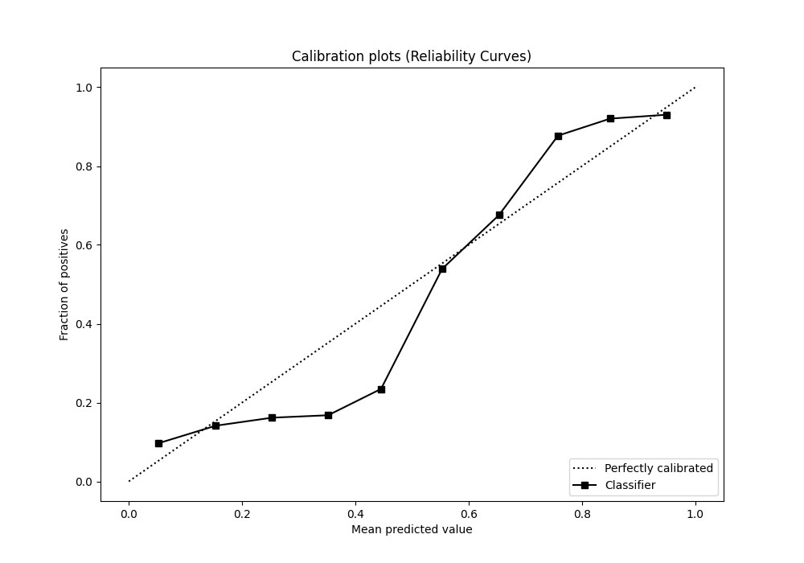
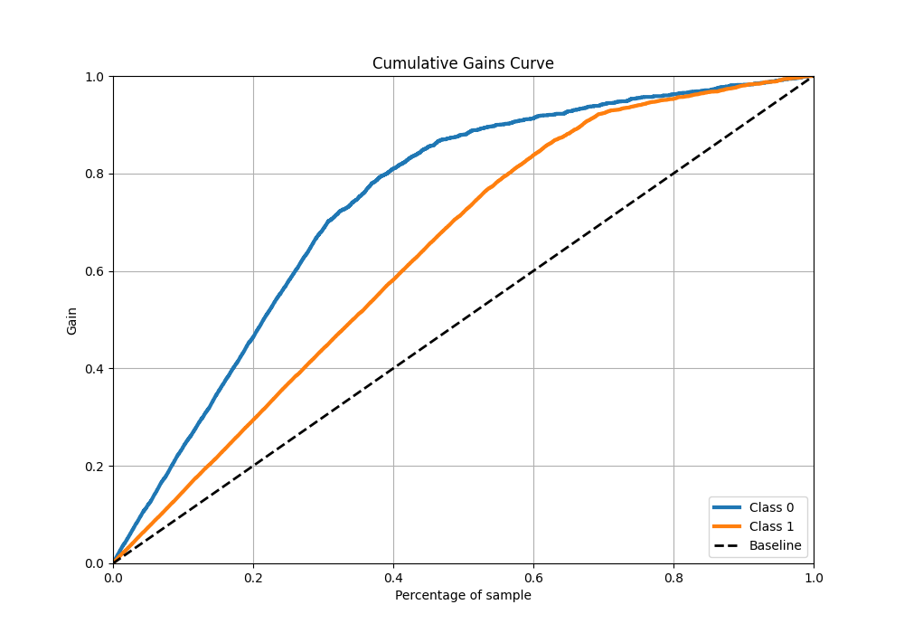
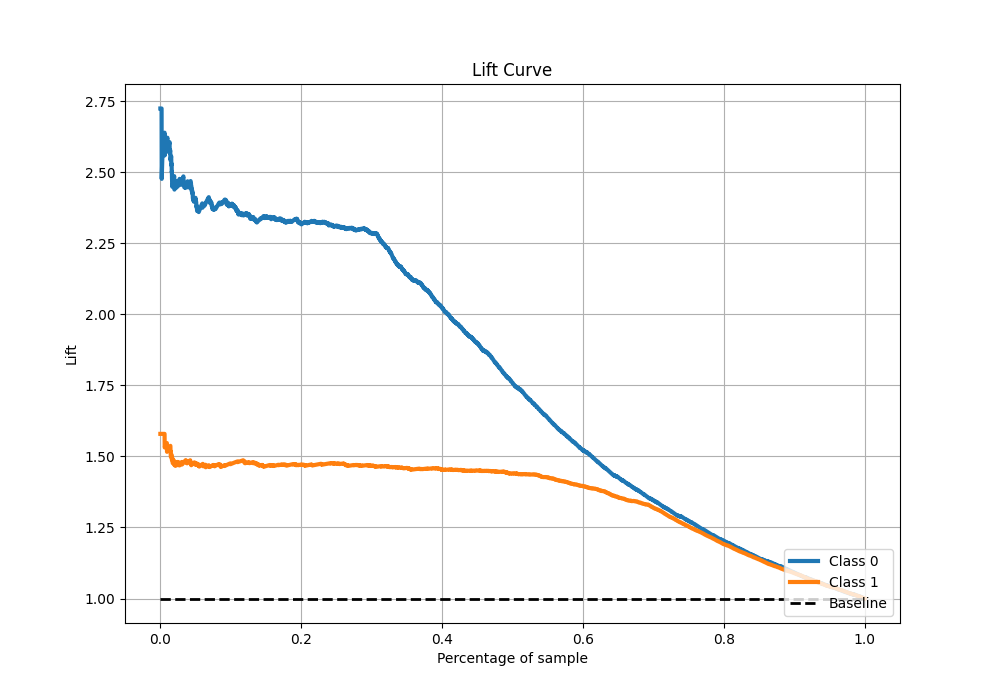

# Summary of 73_LightGBM_Stacked

[<< Go back](../README.md)

## LightGBM
- **n_jobs**: -1
- **objective**: binary
- **num_leaves**: 95
- **learning_rate**: 0.05
- **feature_fraction**: 0.5
- **bagging_fraction**: 0.5
- **min_data_in_leaf**: 20
- **metric**: custom
- **custom_eval_metric_name**: f1
- **explain_level**: 1

## Validation
 - **validation_type**: kfold
 - **k_folds**: 10
 - **shuffle**: True
 - **stratify**: True
 - **random_seed**: 12

## Optimized metric
f1

## Training time

40.7 seconds

## Metric details
|           |    score |   threshold |
|:----------|---------:|------------:|
| logloss   | 0.436253 | nan         |
| auc       | 0.878081 | nan         |
| f1        | 0.878783 |   0.493081  |
| accuracy  | 0.83933  |   0.52317   |
| precision | 0.940594 |   0.914128  |
| recall    | 1        |   0.0173431 |
| mcc       | 0.648369 |   0.52317   |

## Metric details with threshold from accuracy metric
|           |    score |   threshold |
|:----------|---------:|------------:|
| logloss   | 0.436253 |   nan       |
| auc       | 0.878081 |   nan       |
| f1        | 0.87726  |     0.52317 |
| accuracy  | 0.83933  |     0.52317 |
| precision | 0.849416 |     0.52317 |
| recall    | 0.906991 |     0.52317 |
| mcc       | 0.648369 |     0.52317 |

## Confusion matrix (at threshold=0.52317)
|              |   Predicted as 0 |   Predicted as 1 |
|:-------------|-----------------:|-----------------:|
| Labeled as 0 |             1378 |              529 |
| Labeled as 1 |              306 |             2984 |

## Learning curves

## Permutation-based Importance

## Confusion Matrix

## Normalized Confusion Matrix

## ROC Curve

## Kolmogorov-Smirnov Statistic

## Precision-Recall Curve

## Calibration Curve

## Cumulative Gains Curve

## Lift Curve

[<< Go back](../README.md)
